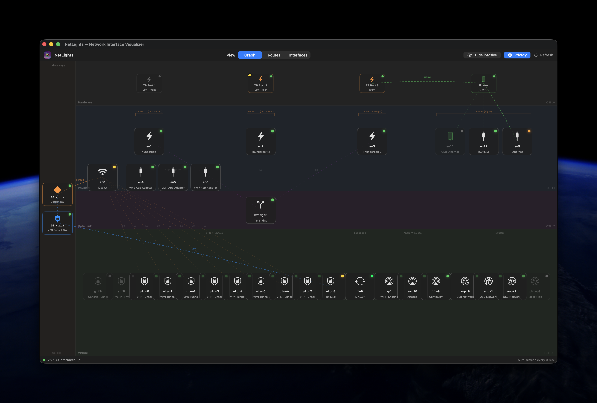

<div align="center">

# NetLights

**A live, layered map of your Mac's network interfaces.**


NetLights arranges every network interface on your Mac into horizontal bands that
mirror the network stack — from the physical chassis ports at the top down to virtual
tunnels at the bottom — and lights up live link, traffic, device, and power state.



</div>

---

## Install

### Download the app (no build required)
1. Grab `NetLights-1.0.zip` from the [Releases](../../releases) page.
2. Unzip and drag **NetLights.app** into your **Applications** folder.
3. **First launch:** because the app isn't notarized with a paid Apple Developer ID,
   macOS Gatekeeper will warn you. **Right-click the app → Open → Open** once, and
   it'll launch normally thereafter. (This is expected for open-source apps without
   a $99/yr signing certificate — the source is right here for you to inspect.)

### Build from source
```bash
git clone https://github.com/willowhawk-k/NetLights.git
cd NetLights
swift run                 # build & launch
# or, to produce a distributable NetLights.app + zip:
./scripts/build-app.sh    # output in dist/
```
Requires Xcode command-line tools (Swift 5.9+) on macOS 13 or later.

---

## What you're looking at

### The layer bands
| Band | OSI | Contents |
|------|-----|----------|
| **Hardware** | L0 | Physical USB-C / Thunderbolt receptacles, plus directly-attached devices (e.g. an iPhone). Position labels come from a per-model layout table. |
| **Physical** | L1 | Real link-layer interfaces: Wi-Fi, Thunderbolt-bridge members (`en1`–`en3`), USB Ethernet, and app/VM virtual adapters. TB & iPhone interfaces sit under their hardware port. |
| **Data Link** | L2 | Bridges and VLANs (e.g. `bridge0`, the Thunderbolt Bridge), centered over their members. |
| **Virtual** | L3+ | Software-defined interfaces: VPN/`utun` tunnels, loopback, AWDL (AirDrop), Continuity, system interfaces. |

### Nodes, LEDs & lines
- **Green dot** — active link / device attached.
- **Amber ant-crawl** — live traffic; the dashes march while bytes move and hold steady (no blink) for ~3 s after activity stops.
- **Dim dot** — no link / nothing attached.
- **Connection lines** — hardware port → its `en*` interfaces, bridge ↔ members, interface → gateway. Emphasized links (iPhone ↔ port, VPN egress) stay brightly lit.

### Hardware ports & power
- A port lights if **anything** is physically attached — a Thunderbolt device, a USB-C cable/device, an iPhone, or even a **charger** — regardless of whether it carries network traffic.
- A yellow **⚡︎ plug badge** marks a port with a USB-C charger attached.
- A USB-connected **iPhone** is detected via the IOKit USB tree, mapped to its physical receptacle, and joined to that port with a green "USB-C" link.

### Gateways (left sidebar)
- **Default GW (orange)** — your primary next hop (typically the router).
- **VPN GW (blue)** — a default route that egresses over a tunnel. The chain
  `utun → VPN GW → Wi-Fi GW → Wi-Fi port` is drawn explicitly, and the tooltip
  shows the physical gateway it ultimately exits through.

---

## How it works (data sources)

NetLights is **read-only** and needs **no elevated privileges** — it never changes
configuration.

| Data | Source |
|------|--------|
| Interfaces & addresses | `getifaddrs()` |
| Link state, MAC, MTU, byte counters | `sysctl(NET_RT_IFLIST)` |
| Routes & gateways | `sysctl(NET_RT_DUMP)` over `PF_ROUTE` |
| Friendly hardware-port names | SystemConfiguration (`SCNetworkInterface`) |
| Thunderbolt receptacle status | `system_profiler SPThunderboltDataType` |
| Attached devices, iPhone port, power | `ioreg` (IOUSB + `AppleHPM` USB-C PD controller) |

### Capabilities & restrictions
- **No admin rights** — everything runs as your user, read-only.
- **Refresh cadence** — interface/route data every 0.75 s; the slower port-topology
  probe runs ~every 5 s on a background thread so the UI never stalls.
- **Link speed** — read from the interface's 32-bit baud field, so values above
  ~4.3 Gbps may under-report on some links.
- **Port front/rear labels** — receptacle position labels come from a hand-curated
  per-model table and may be approximate on some Macs; connection/power state itself
  is read live and accurate.
- **Locked iPhone** — hidden from `system_profiler`'s USB list, so NetLights falls
  back to the IOKit registry to find it.

---

## Contributing

PRs and forks welcome! The project is a single SwiftPM executable target.

```
Sources/NetLights/
├── NetLightsApp.swift        # @main App, menu commands, dock icon, lifecycle
├── ContentView.swift         # Tabs: Graph / Routes / Interfaces
├── NetworkMonitor.swift      # All system data gathering (sysctl/IOKit/system_profiler)
├── InterfaceModel.swift      # Data models + per-Mac port layout table
├── NetworkGraphView.swift    # The layered graph: layout, lines, animation
├── InterfaceNodeView.swift   # Interface node + tooltip
├── HardwarePortNodeView.swift# Hardware port / iPhone node
├── GatewayNodeView.swift     # Gateway node + tooltip
├── AppIconView.swift         # SwiftUI app icon (also rasterized for the dock)
├── AboutView.swift / HelpView.swift
└── AssetExport.swift         # Build-time .icns / QR generation
scripts/build-app.sh          # Packages dist/NetLights.app + zip
```

**Adding your Mac's port layout:** if your model shows generic port positions,
extend `hardwarePortLayout(model:)` in `InterfaceModel.swift` with your
`hw.model` identifier (find it via `sysctl hw.model`).

Found a bug or have a Mac with a different layout? Please open an issue with the
output of `sysctl hw.model` and a screenshot.

---

## Support 💜

NetLights is free and MIT-licensed. If it saved you some head-scratching and
you'd like to say thanks, you can [**sponsor me on GitHub**](https://github.com/sponsors/willowhawk-k)
— there's also a **Sponsor** button at the top of this repo.

Entirely optional — a ⭐️ on the repo is just as welcome!

---

## Credits

Created by **Keith Willowhawk**, pair-programmed with **Claude (Anthropic)**.
Claude helped architect the layered layout engine, the low-level `sysctl`/IOKit
data plumbing, the port/power detection, and the docs.

## License

[MIT](LICENSE) © 2026 Keith Willowhawk.

Free to use, modify, and redistribute — **derivative works must retain the
copyright and license notice** (the attribution requirement built into MIT).
