<div align="center">

# NetLights

**A live, layered map of your Mac's network interfaces.**


NetLights arranges every network interface on your Mac into horizontal bands that
mirror the network stack — from the physical chassis ports at the top down to virtual
tunnels at the bottom — and lights up live link, traffic, device, and power state.

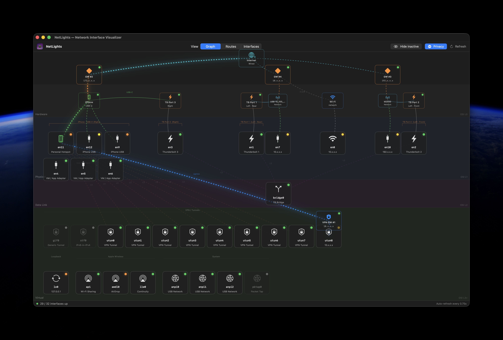

<br>

<!-- app screenshots — click any to view full size -->
<a href="assets/netlights_active.png">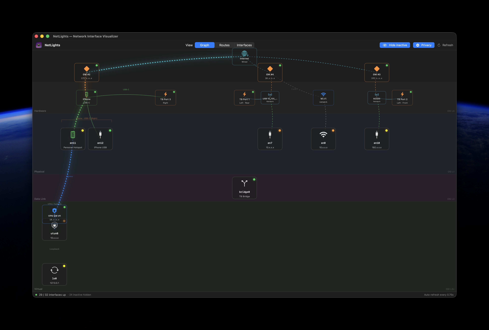</a>
<a href="assets/netlights_devices.png">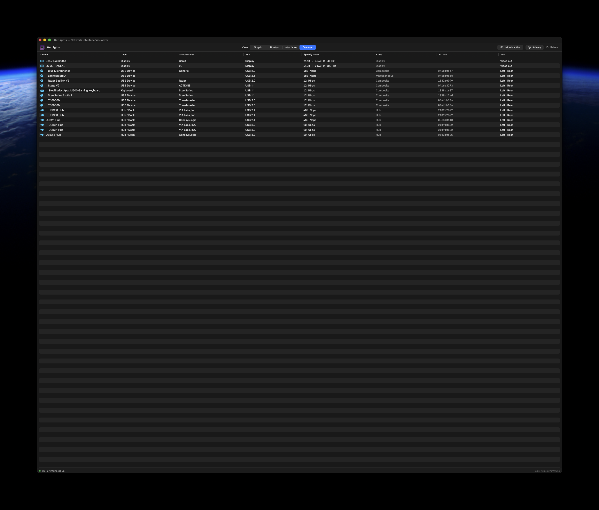</a>
<a href="assets/netlights_routes.png">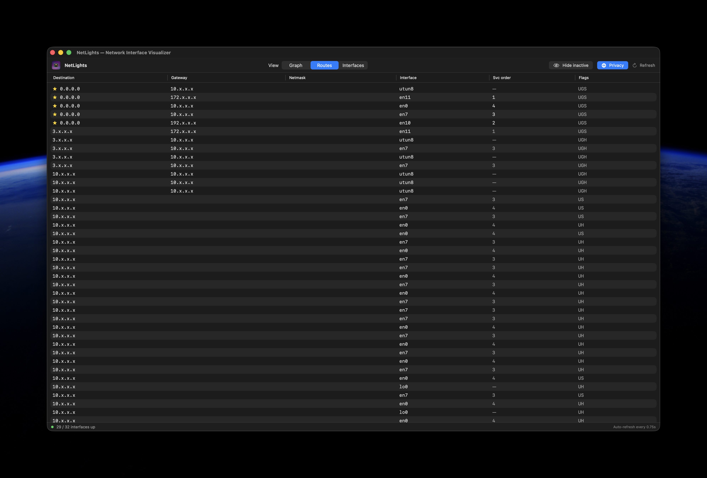</a>
<a href="assets/netlights_interfaces.png">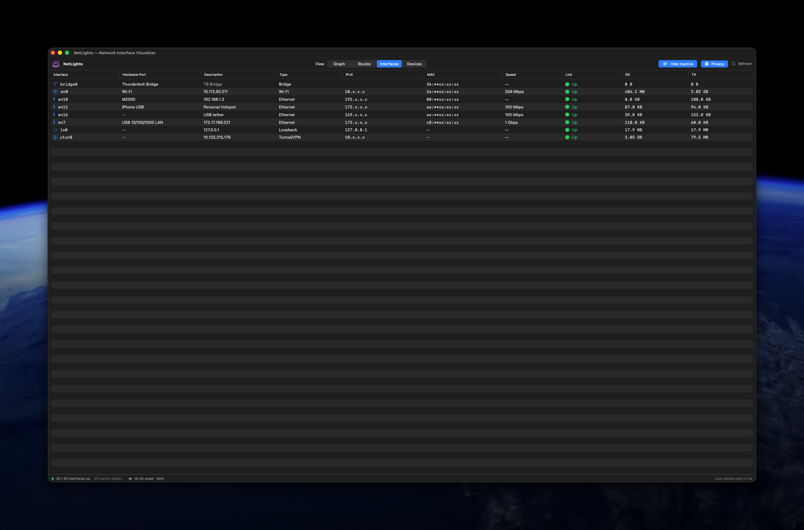</a>

<sub>Graph with live traffic · Devices · Routes · Interfaces — click to enlarge</sub>

<br><br>

<!-- NetLights in the wild (real-life photos) -->
<a href="assets/netlights_irl.png"></a>
<a href="assets/netlights_irl2.png">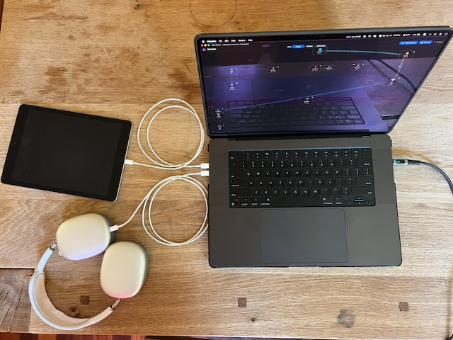</a>

<sub>NetLights running in the wild</sub>

</div>

---

## Install

### Download the app (no build required)
1. Grab the latest `NetLights-*.zip` from the [Releases](../../releases) page.
2. Unzip and drag **NetLights.app** into your **Applications** folder.
3. **Launch it** — the app is **signed and notarized** with an Apple Developer ID,
   so it opens normally with no Gatekeeper warning.

### Build from source
```bash
git clone https://github.com/willowhawk-k/NetLights.git
cd NetLights
swift run                 # build & launch
# or, to produce a distributable NetLights.app + zip:
./scripts/build-app.sh    # output in dist/
```
Requires Xcode command-line tools (Swift 5.9+) on macOS 13 or later.

---

## What you're looking at

### The layer bands
A top row holds the **Internet** node and a tier of **gateway chips**; below it the OSI bands:

| Band | OSI | Contents |
|------|-----|----------|
| **Hardware** | L0 | Physical USB-C / Thunderbolt receptacles, the Wi-Fi network entity, a Displays entity, plus attached devices (iPhone, MiFi, dongles) — hubs/docks expand into a tree. Position labels come from a per-model layout table. |
| **Physical** | L1 | Real link-layer interfaces: Wi-Fi, Thunderbolt-bridge members (`en1`–`en3`), USB Ethernet, and app/VM virtual adapters. TB & iPhone interfaces sit under their hardware port. |
| **Data Link** | L2 | Bridges and VLANs (e.g. `bridge0`, the Thunderbolt Bridge), centered over their members. |
| **Virtual** | L3+ | Software-defined interfaces: VPN/`utun` tunnels, loopback, AWDL (AirDrop), Continuity, system interfaces. |

### Nodes, LEDs & lines
- **Green dot** — active link / device attached.
- **Amber ant-crawl** — live traffic; the dashes march while bytes move and hold steady (no blink) for ~3 s after activity stops.
- **Dim dot** — no link / nothing attached.
- **Connection lines** — hardware port → its `en*` interfaces, bridge ↔ members, interface → gateway. Emphasized links (iPhone ↔ port, VPN egress) stay brightly lit.

### Hardware ports & power
- A port lights if **anything** is physically attached — a Thunderbolt device, a USB-C cable/device, an iPhone, or even a **charger** — regardless of whether it carries network traffic.
- A yellow **plug badge** (a powerplug icon) marks a port with a USB-C charger attached.
- A USB-connected **iPhone** (or **iPad**) is detected via the IOKit USB tree, mapped to its physical receptacle, and joined to that port with a green "USB-C" link.
- **Charging** is shown in the status bar (on AC / charging + adapter wattage), **not** on a port. macOS exposes no per-port power direction — a port *receiving* power (a dock charging the Mac) and one *providing* power (the Mac charging an accessory) are indistinguishable in the registry — so NetLights reports charging at the system level rather than guessing a port.

### Recognizing what's attached
NetLights classifies each USB peripheral and draws it with a fitting icon and a hover tooltip:

<p align="center">
<a href="assets/netlights_headphones.png">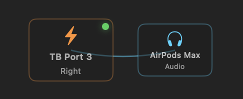</a>
<a href="assets/netlights_apple_battery.png">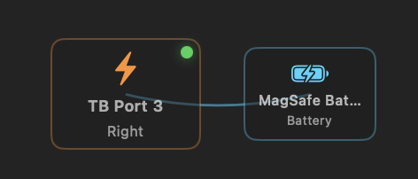</a>
<a href="assets/netlights_whoop_battery.png">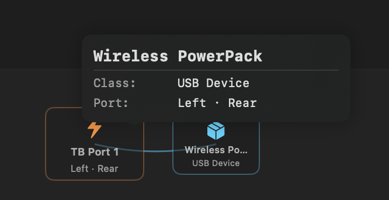</a>
<br>
<a href="assets/netlights_apple_charger.png">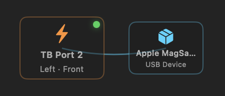</a>
<a href="assets/netlights_usb-pd.png">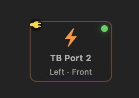</a>
<a href="assets/netlights_tablet.png">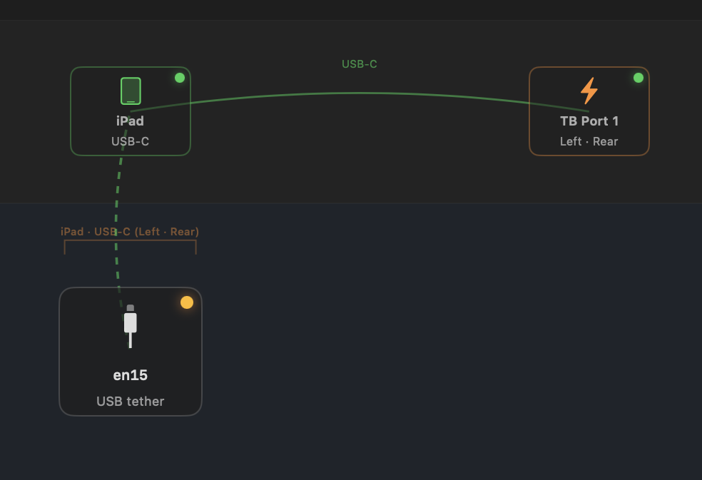</a>
</p>

<sub>Audio (AirPods) · Battery (MagSafe) · generic USB device (with tooltip) · charger · USB-C PD plug badge · iPad vs iPhone — click to enlarge</sub>

### USB hubs, docks & the device tree
Devices behind a hub or dock **nest beneath it as a tidy tree**. Each hardware port
owns its own horizontal region (sized to how much hangs off it), so one port's
subtree — and its wires — never overlap or cross another's.

<p align="center">
<a href="assets/netlights_tree.png">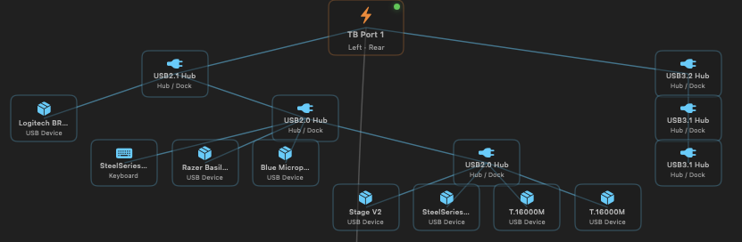</a>
</p>

The **Devices** tab turns the same data into a sortable table — manufacturer, bus
(`USB 2.1` / `3.2` …), negotiated link speed, USB class, `vendor:product` id, and
which port each device sits on. Hovering any chip in the graph shows the same
details.

<p align="center">
<a href="assets/netlights_devices.png"></a>
</p>

### External displays
Connected monitors are detected and grouped under a **Displays** entity; hover one
for its maker, model, and resolution / refresh.

<p align="center">
<a href="assets/netlights_displays.png">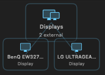</a>
</p>

They're **grouped rather than pinned to a port** on purpose: macOS exposes no way
for an unprivileged app to learn which physical receptacle (or HDMI) a monitor
uses — a DisplayPort-over-USB-C display never appears in the Thunderbolt tree, and
the display data carries no connection type. There's no permission that unlocks
this (unlike the Wi-Fi SSID, which Location access does gate), so NetLights lists
displays instead of guessing a wrong port.

### Gateways & the Internet
- The **Internet** node sits in the top row; every default gateway links up to it.
- **GW #1, #2, … (orange)** — default-route gateways, each pinned in a tier above
  the host it lives on (iPhone, Wi-Fi router, dongle). The number is **precedence** —
  `GW #1` wins the `0.0.0.0/0` race (the active uplink), so you can see at a glance
  which gateway actually carries your traffic.
- **VPN GW (blue)** — a default route over a tunnel, pinned next to its `utun` down
  in the Virtual row, with an egress link to the physical gateway it exits through.

---

## How it works (data sources)

NetLights is **read-only** and needs **no elevated privileges** — it never changes
configuration.

| Data | Source |
|------|--------|
| Interfaces & addresses | `getifaddrs()` |
| Link state, MAC, MTU, byte counters | `sysctl(NET_RT_IFLIST)` |
| Routes & gateways | `sysctl(NET_RT_DUMP)` over `PF_ROUTE` |
| Friendly hardware-port names | SystemConfiguration (`SCNetworkInterface`) |
| Thunderbolt receptacle status | IOKit `IOThunderboltSwitch` (in-process) |
| Attached devices, hub tree, iPhone port | IOKit `IOUSBHostDevice` registry (in-process) |
| USB-C attachment / charger badge | IOKit `AppleHPM` PD controller (in-process) |
| Device details (vendor, class, USB version, link speed) | IOKit registry properties |
| External displays | CoreGraphics `CGGetActiveDisplayList` |
| System charging (AC / wattage) | IOKit `AppleSmartBattery` (system-level, not per-port) |
| Wi-Fi link speed | CoreWLAN negotiated transmit rate |

> **All in-process** as of 1.4 — no `system_profiler`/`ioreg` subprocesses — so NetLights runs under the App Sandbox. See [`APPSTORE.md`](APPSTORE.md).

### Capabilities & restrictions
- **No admin rights** — everything runs as your user, read-only.
- **Refresh cadence** — interface/route data every 0.75 s; the slower port-topology
  probe runs ~every 5 s on a background thread so the UI never stalls.
- **Link speed** — wired links read the interface's 32-bit baud field (values above
  ~4.3 Gbps may under-report); Wi-Fi uses CoreWLAN's current transmit rate, which
  fluctuates as the radio adapts.
- **External displays** — detected and listed, but **not mapped to a specific port**:
  macOS doesn't expose which receptacle (or HDMI) a monitor uses to an unprivileged
  app, and no permission unlocks it. See *External displays* above.
- **Port front/rear labels** — receptacle position labels come from a hand-curated
  per-model table and may be approximate on some Macs; connection/power state itself
  is read live and accurate.
- **Locked iPhone** — hidden from `system_profiler`'s USB list, so NetLights falls
  back to the IOKit registry to find it.
- **Wi-Fi network name (Location)** — macOS only reveals the current SSID to apps
  with Location access, so NetLights requests it **solely to label the Wi-Fi
  uplink**. No location coordinates are ever read, stored, or shared; declining is
  fine (the uplink just shows "Wi-Fi"). The prompt only appears in the packaged
  app, not under `swift run`.

---

## Contributing

PRs and forks welcome! The project is a single SwiftPM executable target.

```
Sources/NetLights/
├── NetLightsApp.swift        # @main App, menu commands, dock icon, lifecycle
├── ContentView.swift         # Tabs: Graph / Routes / Interfaces / Devices
├── NetworkMonitor.swift      # All system data gathering (sysctl/IOKit/system_profiler/CoreWLAN)
├── InterfaceModel.swift      # Data models + per-Mac port layout table
├── NetworkGraphView.swift    # The layered graph: band sizing, tidy-tree layout, lines
├── InterfaceNodeView.swift   # Interface node + tooltip
├── HardwarePortNodeView.swift# Hardware port / iPhone node
├── DeviceNodeView.swift      # USB / display device chip
├── WifiEntityView.swift / VideoEntityView.swift  # Wi-Fi + Displays hardware-row entities
├── GatewayNodeView.swift     # Gateway node + tooltip
├── Tooltips.swift            # Central hover tooltips (port / device / gateway)
├── AppIconView.swift         # SwiftUI app icon (also rasterized for the dock)
├── AboutView.swift / HelpView.swift
└── AssetExport.swift         # Build-time .icns / QR generation
scripts/build-app.sh          # Packages dist/NetLights.app + zip
```

**Adding your Mac's port layout:** if your model shows generic port positions,
extend `hardwarePortLayout(model:)` in `InterfaceModel.swift` with your
`hw.model` identifier (find it via `sysctl hw.model`).

Found a bug or have a Mac with a different layout? Please open an issue with the
output of `sysctl hw.model` and a screenshot.

---

## Support 💜

NetLights is free and MIT-licensed. If it saved you some head-scratching and
you'd like to say thanks, you can [**sponsor me on GitHub**](https://github.com/sponsors/willowhawk-k)
— there's also a **Sponsor** button at the top of this repo.

Entirely optional — a ⭐️ on the repo is just as welcome!

---

## Credits

Created by **Keith Willowhawk**, pair-programmed with **Claude (Anthropic)**.
Claude helped architect the layered layout engine, the low-level `sysctl`/IOKit
data plumbing, the port/power detection, and the docs.

## License

[MIT](LICENSE) © 2026 Keith Willowhawk.

Free to use, modify, and redistribute — **derivative works must retain the
copyright and license notice** (the attribution requirement built into MIT).
