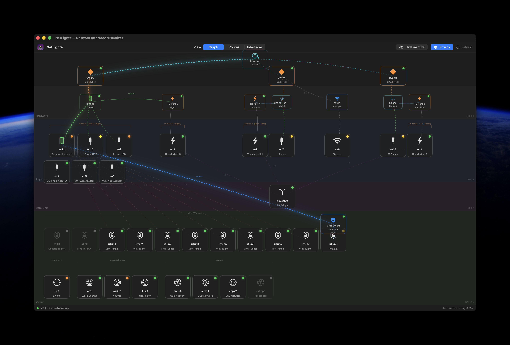
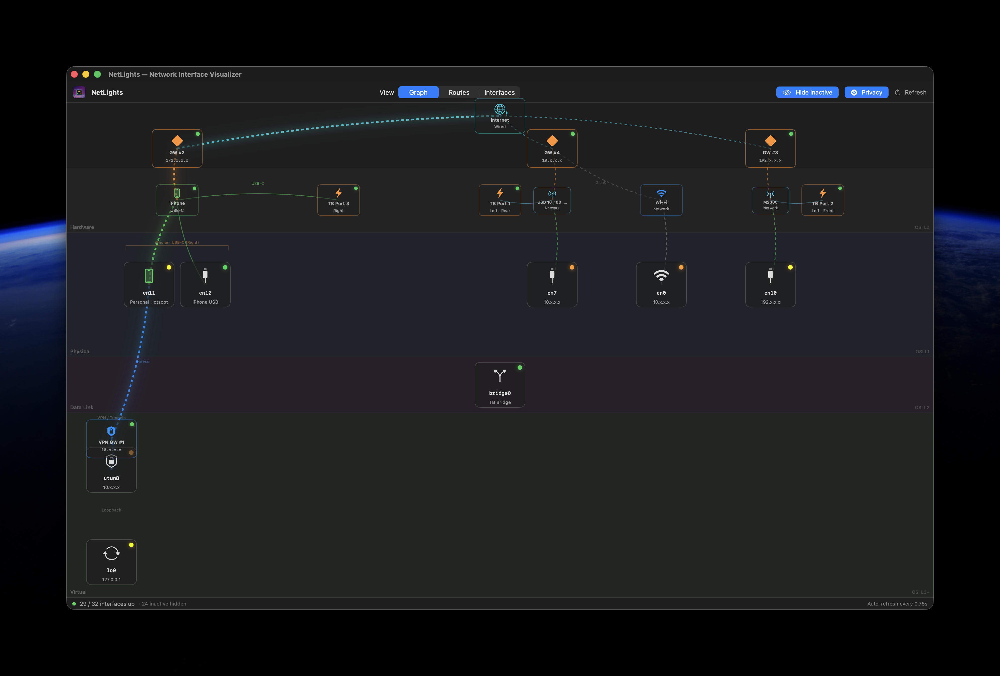
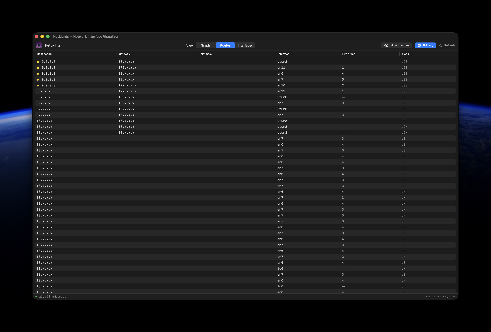
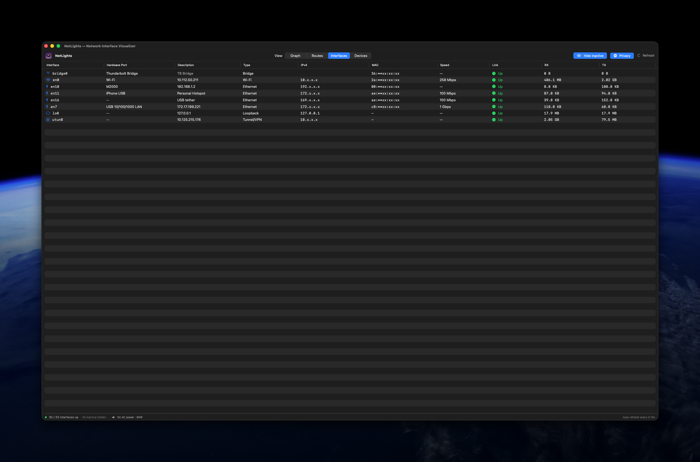
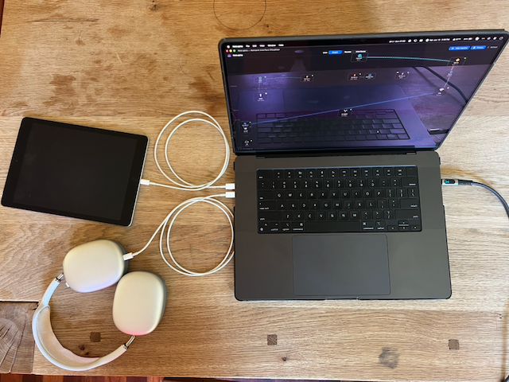

<div align="center">

# NetLights

**A live, layered map of your network interfaces.**


NetLights arranges every network interface on your machine into horizontal bands that
mirror the network stack — from the physical chassis ports at the top down to virtual
tunnels at the bottom — and lights up live link, traffic, device, and power state.



<br>

<!-- app screenshots — click any to view full size -->
<a href="assets/netlights_active.png"></a>
<a href="assets/netlights_devices.png"></a>
<a href="assets/netlights_routes.png"></a>
<a href="assets/netlights_interfaces.png"></a>

<sub>Graph with live traffic · Devices · Routes · Interfaces · DNS — click to enlarge</sub>

<br><br>

<!-- NetLights in the wild (real-life photos) -->
<a href="assets/netlights_irl.png"></a>
<a href="assets/netlights_irl2.png"></a>

<sub>NetLights running in the wild</sub>

</div>

---

## Install

### Homebrew — the app and the `netlights` command

```bash
brew tap willowhawk-k/tap
brew install --cask netlights
```

One tap, and you get **NetLights.app** plus the `netlights` command on your `PATH`.
Updates come with `brew upgrade`.

> Already have NetLights from the **Mac App Store** and only want the command line?
> `brew install netlights-cli` adds the command against the app you already have.
> Install one or the other — both provide a `netlights` executable.

### Mac App Store

Automatic updates, sandboxed, same MIT source:

<a href="https://apps.apple.com/us/app/netlights-map-your-ports/id6784530981?mt=12">
  </a>

The App Store build cannot run `netlights serve` — the sandbox has no
incoming-connections entitlement. Everything else is identical.

### Direct download

1. Grab the latest `NetLights-*.zip` from the [Releases](../../releases) page.
2. Unzip and drag **NetLights.app** into **Applications**.
3. Launch it — signed and notarized with an Apple Developer ID, so no Gatekeeper warning.

### Linux

The command line and the browser UI work today; see
[**docs/LINUX.md**](docs/LINUX.md) for what's supported and what's still landing.

### From source

See [**docs/BUILDING.md**](docs/BUILDING.md).

---

## Using it

Open the app and you get the live graph, plus tabs for **Routes**, **Interfaces**,
**Devices** and **DNS**. Hover anything for detail — a wire shows its negotiated link
speed and live throughput; a port shows what's attached.

[**→ Full visual guide**](docs/GUIDE.md) — what the bands, LEDs, wires and badges mean.

### From a terminal

The same binary is a command-line tool, with an identical grammar on macOS and Linux:

```bash
netlights tui        # live full-screen dashboard, top-style
netlights serve      # the same graph in your browser
netlights --dump-json
```

`netlights tui` switches views with **g**raph / **r**outes / **i**nterfaces /
**d**evices / d**n**s (or `1`–`5`); **q** quits. It works over SSH.

> **`serve` listens on `127.0.0.1` only, by default.** It has no authentication and
> publishes your interfaces, addresses, routes and DNS servers, so exposing it to the
> network (`--bind all`) is an explicit choice that prints a warning. See
> [PRIVACY.md](PRIVACY.md).

[**→ Full command-line reference**](docs/CLI.md)

---

## How it works

NetLights is **read-only** and needs **no elevated privileges** — it never changes
configuration, and everything is read in-process (no `system_profiler`/`ioreg`
subprocesses), so it runs under the App Sandbox.

- [**docs/MACOS.md**](docs/MACOS.md) — macOS data sources, capabilities and limits
- [**docs/LINUX.md**](docs/LINUX.md) — the Linux port: what works, what's coming
- [**docs/BUILDING.md**](docs/BUILDING.md) — building and packaging every artifact
- [**docs/RELEASING.md**](docs/RELEASING.md) — the release checklist, all four channels
- [**PRIVACY.md**](PRIVACY.md) — what is read, what leaves your machine (almost nothing)

---

## Help & support

Questions, bug reports, and feature requests are welcome on the
[**issue tracker**](https://github.com/willowhawk-k/NetLights/issues) — see
[SUPPORT.md](SUPPORT.md) for what to include (OS version, `hw.model`, app version)
and answers to common questions.

**Help ▸ Send Feedback** in the app opens a prefilled issue tagged with your app
version, OS version and Mac model — handy for bug reports and for
[contributing your Mac's port layout](docs/BUILDING.md#adding-your-macs-port-layout).

## Sponsor 💜

NetLights is free and MIT-licensed. If it saved you some head-scratching and
you'd like to say thanks, you can [**sponsor me on GitHub**](https://github.com/sponsors/willowhawk-k)
— there's also a **Sponsor** button at the top of this repo.

Entirely optional — a ⭐️ on the repo is just as welcome!

---

## Credits

NetLights has **no third-party code and no package dependencies**. On Linux it talks to
BlueZ, systemd-resolved and NetworkManager through their documented public interfaces
without linking or bundling any of them — see
[docs/LINUX.md](docs/LINUX.md#interoperability-and-acknowledgments) for the full picture
and thanks.

Created by **Keith Willowhawk**, pair-programmed with **Claude (Anthropic)**.
Claude helped architect the layered layout engine, the low-level `sysctl`/IOKit
data plumbing, the port/power detection, and the docs.

## License

[MIT](LICENSE) © 2026 Keith Willowhawk.

Free to use, modify, and redistribute — **derivative works must retain the
copyright and license notice** (the attribution requirement built into MIT).
