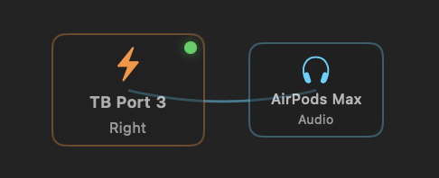
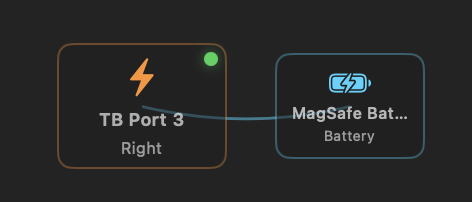
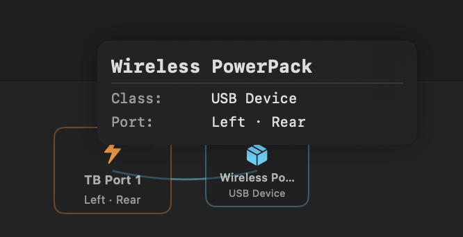
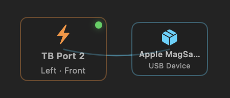
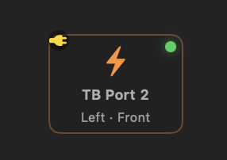
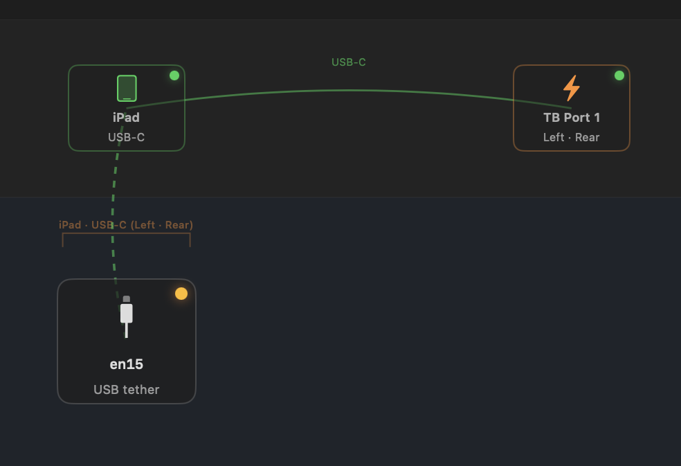
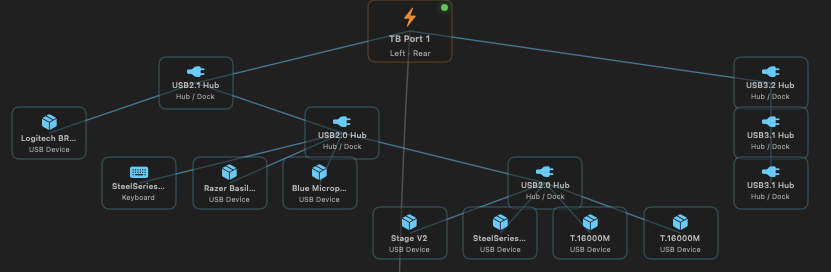
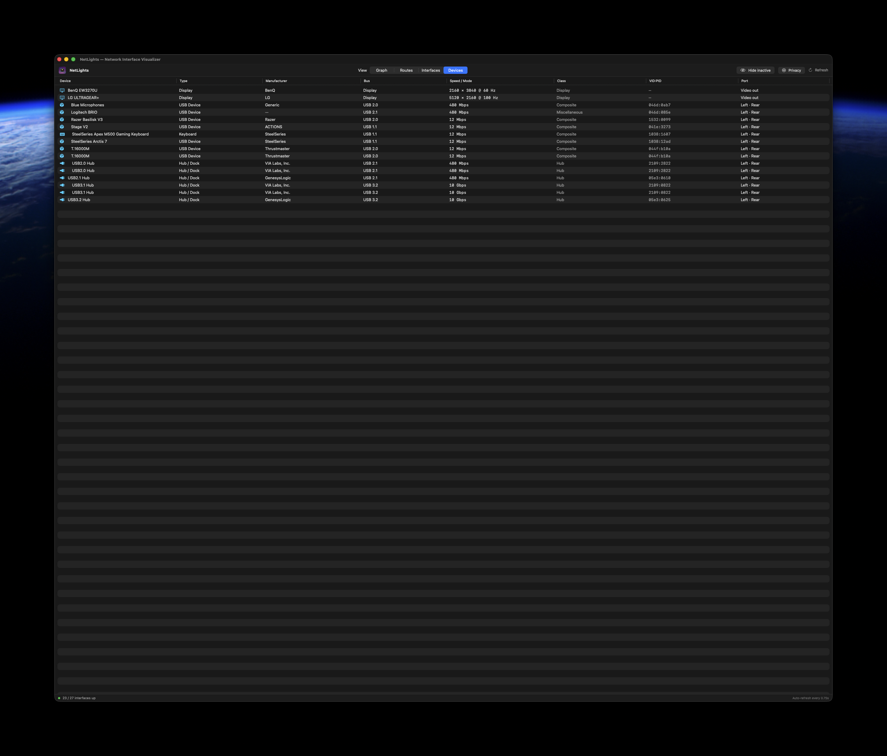
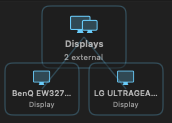

# What you're looking at

A guide to the NetLights graph — the bands, the LEDs, the wires, and what each badge
means. For install and quick-start, see the [README](../README.md).

## The layer bands

A top row holds the **Internet** node and a tier of **gateway chips**; below it the OSI bands:

| Band | OSI | Contents |
|------|-----|----------|
| **Hardware** | L0 | Physical USB-C / Thunderbolt receptacles, the Wi-Fi network entity, a Displays entity, a Bluetooth entity, plus attached devices (iPhone, MiFi, dongles) — hubs/docks expand into a tree. Position labels come from a per-model layout table. |
| **Physical** | L1 | Real link-layer interfaces: Wi-Fi, Thunderbolt-bridge members (`en1`–`en3`), USB Ethernet, and app/VM virtual adapters. TB & iPhone interfaces sit under their hardware port. |
| **Data Link** | L2 | Bridges and VLANs (e.g. `bridge0`, the Thunderbolt Bridge), centered over their members. |
| **Virtual** | L3+ | Software-defined interfaces: VPN/`utun` tunnels, loopback, AWDL (AirDrop), Continuity, system interfaces. |

## Nodes, LEDs & lines

- **Green dot** — active link / device attached.
- **Amber ant-crawl** — live traffic; the dashes march while bytes move and hold steady (no blink) for ~3 s after activity stops.
- **Dim dot** — no link / nothing attached.
- **Connection lines** — hardware port → its `en*` interfaces, bridge ↔ members, interface → gateway. Emphasized links (iPhone ↔ port, VPN egress) stay brightly lit.
- **Throughput on the wire** — a wire carrying a single interface's flow shows its live rate right on the line (e.g. **↓ 98 Mbps  ↑ 12 Mbps**, in bits/sec like the link speed), updated every refresh.

## Link throughput

Hover any connection wire for a **Link** tooltip: the negotiated **link speed**,
the live **Down / Up** rate (in bits/sec — Kbps/Mbps/Gbps, like the link speed —
smoothed so it doesn't jitter between refreshes), and **Received / Sent** byte
totals (data volume, so these stay in bytes). The totals are the OS's
cumulative interface counters — i.e. **since that interface came up** (boot for
built-in interfaces; plug-in for hot-plugged ones like a USB-Ethernet dock or an
iPhone), not since the app launched.

> Per-**app** breakdown isn't shown: per-process network attribution needs a
> private framework (what `nettop` uses) that a sandboxed app can't call.

## Hardware ports & power

- A port lights if **anything** is physically attached — a Thunderbolt device, a USB-C cable/device, an iPhone, or even a **charger** — regardless of whether it carries network traffic.
- A yellow **plug badge** (a powerplug icon) marks a port with a USB-C charger attached.
- A USB-connected **iPhone** (or **iPad**) is detected via the IOKit USB tree, mapped to its physical receptacle, and joined to that port with a green "USB-C" link.
- A **battery entity** in the Hardware row shows charge level and state — *on battery* / *powered* (full, running off the adapter) / *charging* — with the adapter name + wattage on hover (and echoed in the status bar). It's a **system** fact, **not** pinned to a port: macOS exposes no per-port power direction — a port *receiving* power (a dock charging the Mac) and one *providing* power (the Mac charging an accessory) are indistinguishable in the registry, and MagSafe can't be told from USB-C (it's electrically USB-C PD) — so NetLights reports charging at the system level rather than guessing.

## Recognizing what's attached

NetLights classifies each USB peripheral and draws it with a fitting icon and a hover tooltip:

 

Audio (AirPods) · Battery (MagSafe) · generic USB device (with tooltip) · charger · USB-C PD plug badge · iPad vs iPhone — click to enlarge

## USB hubs, docks & the device tree

Devices behind a hub or dock **nest beneath it as a tidy tree**. Each hardware port
owns its own horizontal region (sized to how much hangs off it), so one port's
subtree — and its wires — never overlap or cross another's.

The **Devices** tab turns the same data into a sortable table — manufacturer, bus
(`USB 2.1` / `3.2` …), negotiated link speed, USB class, `vendor:product` id, and
which port each device sits on. Hovering any chip in the graph shows the same
details.

## External displays

Connected monitors are detected and grouped under a **Displays** entity; hover one
for its maker, model, and resolution / refresh.

They're **grouped rather than pinned to a port** on purpose: macOS exposes no way
for an unprivileged app to learn which physical receptacle (or HDMI) a monitor
uses — a DisplayPort-over-USB-C display never appears in the Thunderbolt tree, and
the display data carries no connection type. There's no permission that unlocks
this (unlike the Wi-Fi SSID, which Location access does gate), so NetLights lists
displays instead of guessing a wrong port.

## Bluetooth devices

Connected Bluetooth devices are grouped under a **Bluetooth** entity in the Hardware
row ("Bluetooth is a kind of network"), each shown with its type and — for input
devices (mice, keyboards, trackpads) — its **battery %**.

macOS gates the Bluetooth device list behind a privacy permission, so NetLights asks
for **Bluetooth access** (the same opt-in model as the Wi-Fi SSID's Location prompt).
Decline and the Bluetooth entity simply doesn't appear; the prompt only shows in the
packaged app, not under `swift run`. The access is **read-only** — NetLights lists
already-connected devices and never scans, pairs, or connects.

> **Audio-device battery** (AirPods, headphones, speakers) is **not shown**: macOS
> keeps it in the Bluetooth daemon, reachable only via the `system_profiler`
> subprocess NetLights dropped for sandbox compatibility. Input-device battery comes
> from the IORegistry, which is readable in-process.

## Gateways & the Internet

- The **Internet** node sits in the top row; every default gateway links up to it.
- **GW #1, #2, … (orange)** — default-route gateways, each pinned in a tier above
  the host it lives on (iPhone, Wi-Fi router, dongle). The number is **precedence** —
  `GW #1` wins the `0.0.0.0/0` race (the active uplink), so you can see at a glance
  which gateway actually carries your traffic.
- **VPN GW (blue)** — a default route over a tunnel, pinned next to its `utun` down
  in the Virtual row, with an egress link to the physical gateway it exits through.

When a VPN is active the whole encrypted path is drawn as a distinct glowing tunnel,
out to a far-side concentrator node beyond the Internet node; traffic that bypasses the
tunnel (split-tunnel "excludes") runs alongside it as a separate unencrypted amber
strand. Encrypted-blue vs plaintext-amber, side by side.

## DNS resolvers

The **DNS** tab surfaces the resolvers name resolution actually uses — as diagnosable
as knowing which interface you egress on. A banner shows the **active/global** set (the
"which DNS wins" answer) above a table of every network service's set: bound interface,
server addresses, search domains, and **split-DNS** scoping (`SupplementalMatchDomains`).
The OS **primary** service is starred, so a VPN pushing its own resolvers is plainly
visible winning over your physical uplinks'. Read live from SystemConfiguration
(`SCDynamicStore`) — in-process, no privileges. Privacy mode masks resolver IPs and
redacts search / scoped domains and user-named services.

On Linux the same tab resolves *past* the local stub — see [LINUX.md](LINUX.md#dns).

## Routes

The **Routes** table groups into **Direct (split-tunnel)**, **Encrypted (VPN tunnel)**
and **Local** sections, each sorted by destination, with a one-click toggle back to a
flat numerically-sorted list.

## Privacy mode

The toolbar's **Privacy** toggle masks IP and MAC addresses everywhere — graph,
tooltips and tables — keeping the IPv4 first octet and the MAC vendor OUI so the
shape of the network stays readable. Loopback and netmasks are left intact.
